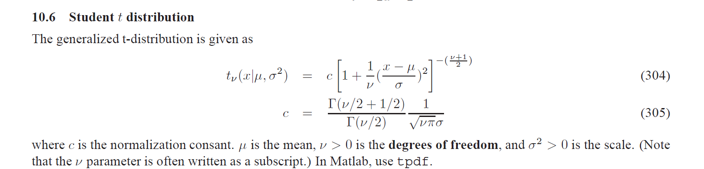

**Cilji učne enote:**

* Modeliranje z normalno porazdelitvijo
* Razumeti kaj testiranje z ničelno hipotezo je in kaj ni
* Razlikovati med testiranjem z ničelno hipotezo in bayesovskim pristopom

# Klasično testiranje hipotez

## Pričakovana teža pujskov pasme Poland China
```{r}
library(ggplot2)
library(reshape2)
```


Zbrali smo podatke o težah pujskov neke določene svinje te pasme:

```{r}
y <- c(1.2, 2.3, 2.6, 3.2, 2.2, 3.5, 3.1)
```

Radi bi sklepali o pričakovani teži pujskov te svinje. Bolj konkretno, radi bi se odločili, če je pričakovana teža pujskov te svinje več kot 2.0 kg.

Da si nekoliko poenostavimo razmišljanje, lahko predpostavimo, da so posamezni pujski neodvisno in enako porazdeljeni.

## Uporabimo t-test

Velika večina raziskovalcev bi v tem primeru poseglo po t-testu, saj so nas v večini primerov tako tudi naučili.

Naredimo enostranski t-test z ničelno hipotezo, da je pričakovana teža pujskov te svinje 2.0 kg (to je enako, kot če bi vsem pujskom odšteli 2.0 kg in naredili test z ničelno hipotezo 0.0, ampak smo se raje odločili za prvo različico, da pri interpretaciji ne bo potrebno prištevati 2.0 kg).

```{r}
res <- t.test(x = y, mu = 2.0, alternative = "greater")
print(res)
```
Sedaj imamo praktično vse, kar potrebujemo za intrepretacijo rezultatov tega testa. Preizkusimo svoje razumevanje z odgovori na ta DA-NE vprašanja:

1. Dokazali smo, da je alternativna hipoteza mu > 2 pravilna?
2. Dokazali smo, da je ničelna hipoteza mu = 2 napačna?
3. Iz rezultatov lahko razberemo verjetnost alternativne hipoteze?
4. Iz rezultatov lahko razberemo verjetnost ničelne hipoteze?
5. Če se odločimo zavrniti ničelno hipotezo, lahko razberemo verjetnost napačne odločitve?

## Razumevanje testiranja z ničelno hipotezo

Testiranje z ničelno hipotezo (NHST, Null-Hypothesis Statistical Test) je še vedno prevladujoč pristop za statistično sklepanje v znanosti in stroki. T-test je najbolj pogosto NHST, zato si ga bomo podrobneje pogledali in s tem tudi bistvo NHST.

### Model, ki se skriva v ozadju

Imamo torej vzorec

$$y = (y_1, y_2, ..., y_n), y_i \in \mathbb{R}$$

zanima pa nas pričakovana vrednost procesa, ki ga generira.

Predpostavili bomo, da je normalna porazdelitev dober model za ta proces. S smiselnostjo tega modela se v tem trenutku ne bomo ukvarjali, kasneje pa bomo pokazali, zakaj je ta model smiseln tudi, ko porazdelitev ni normalna, vsaj v primerih, ko imamo dovolj podatkov in nas zanima le pričakovana vrednost:

$$ y_i | \mu, \sigma^2 \sim_\text{iid} N(\mu, \sigma^2)$$

ali, z drugimi besedami,

$$p(y_i|\mu, \sigma) = \frac{1}{\sqrt{2\pi\sigma^2}} e^{-\frac{(y_i - \mu)^2}{2\sigma^2}}.$$

### Kaj nas pravzaprav zanima?

Že intuicija nam pravi, da je vzorčno povprečje dober približek upanju mu, ki bi ga radi bolje razumeli. Kot statistiki pa se seveda zavedamo, da imamo opravka z negotovostjo in moramo vložiti še nekaj statisitčnega truda, da jo ovrednostimo.

Če nas pri pujskih zanima predvsem to, ali je upanje večje od 2.0 kg, potem sledi, da potrebujemo metodo, ki nam bo ponudila odgovor na vprašanje, kolikšna je verjetnost, da je mu večje/manjše od neke mejne vrednosti mu0. Formalno, zanima nas odgovor na vprašanje

$$P(\mu < \mu_0 | y) =\mbox{ ?}$$

Če smo Bayesovci, potem lahko nadaljujemo (in kasneje tudi bomo), ampak zaenkrat se bomo vrnili v začetek 20. stoletja in postavili v kožo ne-bayesovcev, ki so takrat postavljali temelje za statistiko, kot jo večinoma poslušamo še danes.

Klasičen pogled na verjetnost je tak, da podatke obravnavamo kot slučejen (ponovljiv) vzorec iz porazdelitve, parametre te porazdelitve (npr. naš mu) obravnavamo kot neznane konstante. Naš prag mu0 je tudi konstanta. Razlika med konstantama je seveda tudi konstanta, o konstantah pa ne moremo postavljati verjetnostnih vprašanj!

Kaj lahko storimo?

### Odličen odgovor na napačno vprašanje

Podobno vprašanje so si pred približno 100 leti postavljali tudi statistiki. Med njimi tudi William S. Gosset, analitik pri pivovarni Guinness, statistik in prijatelj/učenec enega največjih statistikov, Fisherja.

Edina razlika je, da je Gosseta bolj kot teža pujskov zanimala kvaliteta piva.

Če želimo ovrednotiti negotovost, jo moramo seveda najprej tudi imeti - potrebujemo nekaj, kar je slučajna spremenljivka. V klasičnem pogledu na verjetnost, so to podatki y, za katere predpostavimo, da so realizacija slučajnega in ponovljivega procesa.

Ključna ideja Gosseta je bila, da bomo o upanju mu sklepali posredno:

1. Predpostavili bomo model in da ima upanje vrednost, ki nas najbolj zanima (H0, ničelna hipoteza!).
2. Definirali bomo neko lastnost vzorca, ki vzorec povzema (testna statistika!).
3. (vzorčna porazdelitev testne statisitke!)
4. Izračunali bomo lastnost dejanskega vzorca.
5. Če je za lastnost vzorca zelo malo verjetno, da je prišla iz predpostavljene porazdelitve, bomo sklepali, da predpostavka ne drži (stopnja tveganja, p-vrednost).

**Vsi** NHST sledijo tem korakom! Razlikujejo se le v modelih, parametrih, ki nas zanimajo, in testnih statistikah.

### Studentov t-test

Da se ne bi preveč razvedelo, kaj Guiness počne pri svojih proizvodnih procesih, je Gosset članek objavil pod psevdonimom Student.

**H0: ničelna hipoteza**

Modeliramo z normalno porazdelitvijo. Naša predpostavka je, da je pričakovana vrednost porazdelitve mu0, varianca s2 pa naj, zaenkrat, ostane neznana konstanta (kasneje se je znebimo).

**Testna statistika**

Za lastnost, ki dobro povzema vzorec iz normalne porazdelitve, bomo vzeli, koliko se vzorčno povprečje razlikuje od pričakovane vrednosti, standardizirano na enoto vzorca. To lastnost bomo označili s t:

$$t = \frac{\overline{y} - \mu_0}{\frac{s}{\sqrt{n}}}, $$
kjer s v imenovalcu izhaja iz nepristranske ocene variance $$s^2 = \frac{1}{n-1}\sum_{i=1}^n(y_i - \overline{y})^2$$.

Intuicija: t nam pove, kako močno se vzorčno povprečje odklanja od pričakovanega, pri čemer upoštevamo, da se pri večji varianci večji odkloni bolj pričakovani.

**Porazdelitev testne statistike**

Če na vzorec gledamo kot na realizacijo slučajnega procesa, sta povprečje in s2 v zgornji statistiki slučajni spremenljivki. Posledično je tudi t slučajna spremenljivka in lahko izpeljemo njeno porazdelitev.

Z malo razmisleka in računanja (npr. http://math.arizona.edu/~jwatkins/ttest.pdf) lahko izpeljemo, da

$$p(t) \propto (1 + \frac{t^2}{n-1})^{-\frac{n}{2}}.$$
Testna statistika je porazdeljena s porazdelitvijo t z n prostostnimi stopnjami!

Lahko si jo narišemo za naš konkreten primer:


```{r,fig.height = 3, fig.width = 5}
n <- length(y)
x   <- seq(-5, 5, 0.01)
tmp <- data.frame(x = x, y = dt(x, n - 1))
ggplot(tmp, aes(x = x, y = y)) + geom_line()

```

Dobro je vedeti:

* Da so podatki porazdeljeni iid normalno je zadosten pogoj, ni pa nujno potreben. V praksi je v večini primerov dovolj že, da je vzorec dovolj velik (če le porazdelitev podatkov ni preveč posebna), saj je vzorčno povprečje porazdeljeno približno normalno (CLT), kar je zadosten pogoj.
* Porazdelitev t limitira k standardni normalni, ko gre n proti neskončno.

**Vrednost statistike na vzorcu**

```{r}
mu0 <- 2.0
s2 <- (sum((y - mean(y))^2)) / (n - 1)
t_sample <- (mean(y) - mu0) / (sqrt(s2 / n))
print(t_sample)
```

**Test**

Izberimo stopnjo tveganja 0.05. Kaj to v praksi pomeni? Da bomo, če H0 drži, v 5% primerov zavrnili H0, čeprav je resnična. Sprejeli smo 5% tveganje za napako prvega tipa (false positive).

Ker izvajamo enostranski test (zanimajo nas alternative, kjer vzorec odstopa v smer 2.0 ali več), bomo izračunali verjetnost, da bi dobili takšno ali bolj ekstremno vrednost statistike na vzorcu, če bi ničelna hipoteza bila resnična.

```{r,fig.height = 3, fig.width = 5}
ggplot(tmp, aes(x = x, y = y)) + geom_line() + geom_vline(xintercept = t_sample, colour = "red", lty = "dashed") +
  geom_text(data = data.frame(x = t_sample + 1.5, y = 0.3), label = "value for sample", colour = "red")
  
```

Izgleda relativno malo verjetno. Točno verjetnost dobimo z integriranjem oz. iz kumulativne porazdelitve:

```{r,fig.height = 3, fig.width = 5}
p <- 1 - pt(t_sample, n - 1)
print(p)
```
Rezultat je identičen tistemu, ki smo ga dobili z vgrajeno funkcijo.

## Povzetek najpogostejših napak pri testiranju hipotez

**Pragovi 0.1, 0.05, 0.01.. nimajo nobenega posebnega pomena** in **Statistična signifikantnost ni (nujno) praktična pomembnost**

Kako določimo prag tveganja, je subjektivna odločitev. Fisher je najpogosteje zagovarjal, da poročamo p vrednost in na podlagi tovrstnih testov ne sprejemamo binarnih odločitev. Na žalost je prag 0.05 postal standard: https://normaldeviate.wordpress.com/2012/08/16/p-values-gone-wild-and-multiscale-madness/

P-vrednost je tudi funkcija velikosti vzorca. Z dovolj velikim vzorcem bomo v praksi verjetno zavrnili čisto vsako hipotezo (redko bo parameter identičen neki vrednosti).

**Ničelne hipoteze ne moremo sprejeti**

Vsaj ne z neko utemeljitvijo. Lahko jo zavrnemo, saj imamo verjetnost, da bi dobili take podatke, če bi bila resnična. To pa je tudi edina informacija, ki jo imamo.

**Stopnja tveganja ne nadzoruje deleža napačnih odločitev**

Kot smo videli, stopnja tveganja pomeni delež napačnih odločitev, ko je ničelna hipoteza resnična. To se nanaša le na napake 1. tipa (false positive), ne pa tudi na napake 2. tipa (false negative). Za ilustracijo si poglejmo ekstremen primer: Vzemimo farmacevtsko podjetje, ki razvije 20 zdravil na leto, pri čemer so tako slabi, da nobeno izmed njihovih zdravil nima nobenega učinka. S predpisano stopnjo tveganja 0.05 bodo v povprečju vsako leto po naključju (false positive) imeli odobreno eno zdravilo. V 10 letih bodo torej na trg spravili okoli 10 zdravil, od katerih prav nobena nima učinka!

Ta problem se že kaže v znanosti, kjer na določenih področjih več kot pol (!!!) člankov ni moč reproducirati. In glavni razlog je to, da raziskovalci pri svojih statističnih analizah ne upoštevajo, da morda postavljajo hipoteze, ki so večinoma napačne (ni učinka), in je večina zavrnitev tega, da ni učinka, napačnih!

https://www.nature.com/news/1-500-scientists-lift-the-lid-on-reproducibility-1.19970

***Testiranje tipa Neyman-Pearson odpravlja nekaj pomanjkljivosti***

Bolj poučeni se boste spomnili na napake 2. tipa in moč testov (beta). O tem nismo govorili, ker to ni del fisherjanskih NHST. Ta pojem se pojavi pri testiranju tipa Neyman-Pearson, kjer postavimo alternativno hipotezo v obliki modela.

V tem konceptualnem okvirju lahko zavrnemo alternativno hipotezo in sprejememo ničelno. Prav tako lahko kontroliramo napaki obeh tipov (z večanjem vzorca). A pozor, v tem okvirju moramo bolje razumeti problem in načrtovanje poskusa, saj moramo določiti alternativno(e) hipotezo in število vzorcev, ki jih potrebujemo, da dosežemo želeno tveganje/moč.

# Bayesovski pristop

Kar se podatkov in modela (verjetja) tiče, je bayesovski pogled enak

$$y = (y_1, y_2, ..., y_n), y_i \in \mathbb{R}$$

$$ y_i | \mu, \sigma^2 \sim_\text{iid} N(\mu, \sigma^2).$$

Do prvega razhajanja pride pri vprašanju, na katerega smo najprej želeli odgovoriti, pa smo ugotovili, da klasičen pristop nanj ne more odgovoriti, ker ne parameter porazdelitve ne prag, ki nas zanima, nista slučajni spremenljivki

$$P(\mu < \mu_0 | y) =\mbox{ ?}$$

Bayesovski pristop se od klasičnega razlikuje v tem, da parametre obravnavamo kot slučajne spremenljivke. Ne nujno, ker verjamemo, da je njihova narava slučajna, ampak zato, ker se odločimo, da bomo z verjetnostjo/porazdelitvijo izrazili svojo negotovost glede prave vrednosti parametra. Ker je parameter mu slučajna spremenljivka, nimamo nobenih težav z odgovorom na zgornje vprašanje:


$$P(\mu < \mu_0 | y) = \int_{-\infty}^{\mu_0}p(\mu|y) d\mu.$$

Vse, kar potrebujemo, je marginalna aposteriorna porazdelitev parametra mu, ko vidimo podatke. Le-to bomo enostavno vsaj ocenili, če imamo skupno aposteriorno porazdelitev obeh parametrov $$p(\mu, \sigma^2|y)$$.

## Modeliranje z normalno (upanje in varianca sta neznana)

Čeprav imamo tokrat opravka z modelom, ki ima dva parametra, je bayesovski pristop konceptualno vedno enak:

$$p(\mu, \sigma^2|y) = \frac{p(y |\mu, \sigma^2) p(\mu, \sigma^2)}{p(y)} \propto p(y |\mu, \sigma^2) p(\mu, \sigma^2)$$

Model (verjetje) že imamo, izbrati pa je potrebno apriorno porazdelitev. Ko se bomo naučili delati z orodji za bayesovsko statistiko, ki bodo namesto nas poskrbeli za računski del, bomo precej svobodni pri tej izbiri. Zaenkrat, ko to počnemo sami, smo nekoliko omejeni - izbrali bomo konjugirano apriorno porazdelitev za normalni model, da bo tudi aposteriorna porazdelitev računsko obvladljiva.

Z malo razmisleka bi morda tudi sami ugotovili, katera je ta porazdelitev. Še lažje pa bo, če preprosto poiščemo na spletu (npr. https://en.wikipedia.org/wiki/Conjugate_prior). 

Literatura pravi, da je za normali model konjugirana porazdelitev Normal-InvGamma:

$$p(\mu, \sigma^2) \sim N-invGamma(\mu_0, \nu_0, \alpha_0, \beta_0)$$

Več o njej npr. na https://en.wikipedia.org/wiki/Normal-inverse-gamma_distribution.

To porazdelitev lahko, če faktoriziramo v 

$$p(\mu, \sigma^2) = p(\mu|\sigma^2)p(\sigma^2),$$ 

zapišemo tudi kot


$$\mu|\sigma^2 \sim N(\mu_0, \frac{\sigma^2}{\nu_0}),$$
$$\sigma^2 \sim invGamma(\alpha_0, \beta_0).$$

Omeniti pa velja, da je zelo malo parov model-apriorna konjugiranih. Že pri tem modelu ni nobene druge apriorne porazdelitve, ki bi mu bila konjugirana.

### Aposteriorna porazdelitev 

Iz literature lahko preberemo tudi, kako izgleda aposteriorna porazdelitev

$$\mu|\sigma^2, y \sim N(\mu_n, \frac{\sigma^2}{\nu_n}),$$

$$\sigma^2|y \sim invGamma(\alpha_n, \beta_n).$$

Pri čemer je

$$\mu_n = \frac{\nu_0\mu_0 + n\overline{y}}{\nu_0 + n}, \nu_n = \nu_0 + n$$
in

$$\alpha_n = \alpha_0 + \frac{n}{2}, \beta_n = \beta_0 + \frac{n}{2}\left(VAR[y] + \frac{\nu_0}{\nu_0 + n}(\overline{y} - \mu_0)^2\right)$$


### Implementacija modela

```{r,fig.height = 7, fig.width = 5}

# the model takes data y and has 4 prior constants mu0, nu0, a0, and b0
y <- y
n <- length(y)

mu0 <- 0.0; nu0 <- 0.01; a0 <- 1.0; b0 <- 1.0 # 

# R does not have a built-in invGamma, so we implement our own density...
dinvgamma <- function(x, alpha, beta) {
  beta^alpha / gamma(alpha) * x^(-alpha - 1) * exp(-beta / x)
}

# ...and now we can implement the normal-invGamma density
dnorminvgamma <- function(x_mu, x_s2, mu, nu, alpha, beta) {
  dnorm(x_mu, mean = mu, sd = sqrt(x_s2 / nu)) * dinvgamma(x_s2, alpha, beta)
}


# visualize prior and posterior
x_mu <- seq(-4, 8, 0.05)
x_s2 <- seq(0.05, 5, 0.05)

tmp <- expand.grid(x_mu, x_s2)
tmp$Val1 <- dnorminvgamma(tmp[,1], tmp[,2], 
                          mu = mu0, 
                          nu = nu0, 
                          alpha = a0, 
                          beta = b0)

mu_n = (nu0*mu0 + n*mean(y)) / (nu0 + n)
nu_n = nu0 + n
a_n = a0 + 0.5 * n
b_n = 0.5 * (sum((y-mean(y))^2) + (nu0*n) / (nu0 + n) * (mean(y) - mu0)^2)

tmp$Val2 <- dnorminvgamma(tmp[,1], tmp[,2], 
                          mu = mu_n, 
                          nu = nu_n, 
                          alpha = a_n, 
                          beta = b_n)

names(tmp) <- c("mean", "variance", "Prior", "Posterior")

tmp <- melt(tmp, id.vars = c("mean", "variance"))
names(tmp)[3] <- "Density"
g1 <- ggplot(tmp, aes(x = mean, y = variance, z = value, 
                      group = Density, colour = Density)) + geom_contour()
plot(g1)

```

### Marginalna aposteriorna porazdelitev

V praksi nas varianca običajno niti ne zanima. Tudi mi si želimo predvsem aposteriorno porazdelitev upanja. Čeprav je izpeljava nekoliko zapletena, gre za preprosto marginalizacijo variance iz skupne aposteriorne, ki jo že poznamo

$$p(\mu | y) = \int_{0}^{\infty}p(\mu, \sigma^2|y) d\sigma^2.$$

Rezultat je

$$\mu|y \sim \mbox{generalized-t}_{2\alpha_n}(\mu_n, \frac{\beta_n}{\alpha_n\nu_n})$$

Za matematične izpeljave bayesovskega normalnega modela si poglejte priložen dokument in/ali https://www.cs.ubc.ca/~murphyk/Papers/bayesGauss.pdf.



```{r,fig.height = 4.5, fig.width = 6}

# the model takes data y and has 4 prior constants mu0, nu0, a0, and b0
y <- y
n <- length(y)

mu0 <- 0.0; nu0 <- 0.01; a0 <- 1.0; b0 <- 1.0 # 
#mu0 <- 0.0; nu0 <- 0.0; a0 <- -0.5; b0 <- 0.0 # reference prior

# R does not have a built-in generalized t, so we prepare the density


# ...and now we can implement the normal-invGamma density
dgt <- function(x, mu, s2, df) {
  tmp <- (gamma(0.5 * (df + 1))) / (gamma(df * 0.5) * sqrt(pi * df * s2))
  tmp * (1 + ((x - mu)^2)/(df * s2))^(-0.5 * (df + 1))
}


mu_n = (nu0*mu0 + n*mean(y)) / (nu0 + n)
nu_n = nu0 + n
a_n = a0 + 0.5 * n
b_n = 0.5 * (sum((y-mean(y))^2) + (nu0*n) / (nu0 + n) * (mean(y) - mu0)^2)

x  <- seq(0, 5, 0.01)
fxn <- dgt(x, mu_n, b_n / (a_n * nu_n), 2 * a_n)
fx0 <- dgt(x, mu0, b0 / (a0 * nu0), 2 * a0)
tmp <- data.frame(x = x, y = fxn, dist = "posterior")
tmp <- rbind(tmp, data.frame(x = x, y = fx0, dist = "prior"))

g1 <- ggplot(tmp, aes(x = x, y = y, colour = dist)) + geom_line() + geom_point(data = data.frame(x = y, y = 0, dist = "data"), size = 2)
plot(g1)

# answer to our question
integrate(dgt, lower = -Inf, upper = 2.0, subdivisions = 1000, mu = mu_n, s2 = b_n / (a_n * nu_n), df = 2 * a_n)$value
```

## Nekaj stvari, ki jih je dobro vedeti

### Modeliranje z normalno, ko podatki niso normalno porazdeljeni

Ni težko preveriti, kaj se zgodi z apriornim mnenjem o upanju, ko gre n proti neskončno. Upanje gre proti normalni porazdelitvi z upanjem enakim povprečju in varianci n-krat manjši od variance vzorca. Če upoštevamo še dejstvo, ki sledi iz centralnega limitnega izreka (da porazdelitev povprečja limitira proti normalni), vidimo, da je normalni model primeren za modeliranje upanja, četudi podatki niso normalno porazdeljeni.

### Bayesovska interpretacija t-testa

Če uporabimo t. i. referenčno (neinformativno, Jeffreys-ovo) apriorno porazdelitev, bodo rezultati bayesovske analize številsko identični t-testu (interpretacija je še vedno drugačna).

### Regularizacija z apriornim mnenjem

Zgoraj smo izpostavili problem, da je večina naših pozitivnih odločitev lažnih pozitivnih, če imamo opravka z domeno, kjer je večina primerov negativnih. V bayesovskem okvirju se s tem elegantno spopademo tako, da upanja iz predhodnih raziskav uporabimo kot apriorno porazdelitev za trenutno raziskavo. Intuitivno: če smo v preteklosti večinoma imeli primere, kjer je bil pričakovani učinek blizu nič, potem bomo tudi za nov primer močno verjetli, da nima učinka. Da bi se prepričali v nasprotno, bo vzorec moral biti večji oz. bolj prepričljiv, kot sicer.